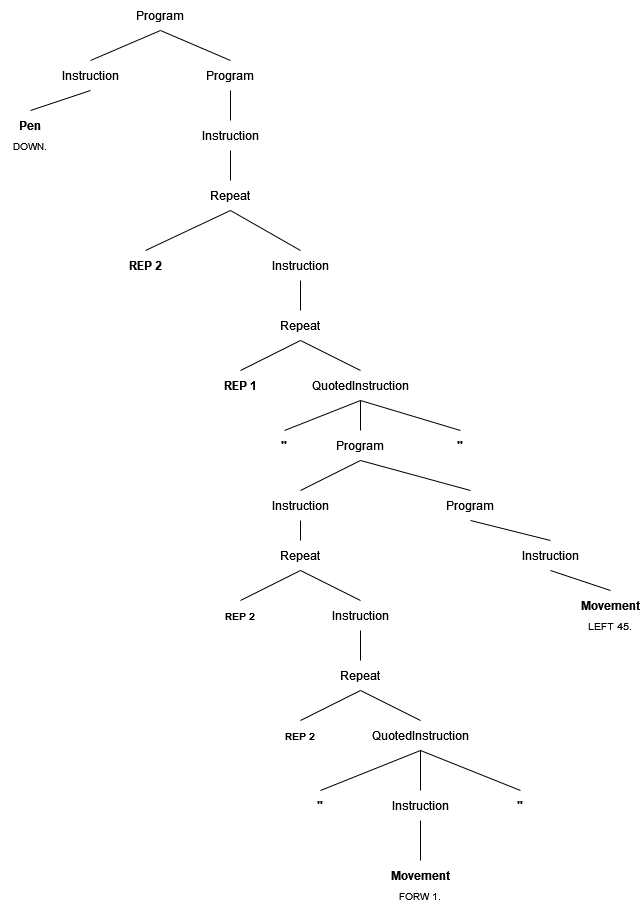

# Leona Language Translator

The Leona Language Translator is a tool designed to translate programs written in the Leona language into a list of line segments represented in Cartesian coordinates. This project has successfully achieved its goal of providing a comprehensive solution for translating Leona programs into graphical representations.

## Features

- **Formal Grammar Construction:** A formal grammar for the Leona language has been constructed using BNF notation, ensuring clarity and precision in language specification.

- **Parse Tree Visualization:** A correct and readable parse tree has been generated for test case 12 using the constructed grammar. This parse tree provides insights into the parsing process and facilitates understanding of the language structure.

- **Lexical Analysis:** The project includes a robust lexical analyzer that efficiently tokenizes input files, laying the foundation for subsequent parsing stages.

- **Recursive Descent Parsing:** A recursive descent parser has been implemented, leveraging the constructed grammar to produce syntax trees from token sequences. This parsing technique ensures accuracy and flexibility in language interpretation.

- **Program Execution Translation:** Code has been developed to execute Leona programs by translating syntax trees into lists of line segments. This translation process accurately captures the movement and drawing instructions specified in the input programs.

- **Integration and Execution:** The project seamlessly integrates lexical analysis, parsing, and execution into a cohesive program. Users can input Leona programs and obtain corresponding line segment representations with ease.

## Usage

To use the Leona Language Translator, follow these steps:

1. Ensure that you have the necessary dependencies installed,  for running the translator.

2. Input your Leona program into the translator.

3. Run the translator program.

4. Obtain the list of line segments representing the graphical output of your Leona program.


## Grammar for the Leona language


### Token List for the Grammar
* FORW = "FORW"
* BACK = "BACK"
* RIGHT = "RIGHT"
* LEFT = "LEFT"
* UP = "UP"
* DOWN = "DOWN"
* COLOR = "COLOR"
* REP = "REP"
* HEX = "^#([A-Fa-f0-9]{6})$"
* DECIMAL = "[0-9]+"
* PERIOD = "."
* QUOTE = " " "
* ERROR = "ERROR"


### Backus-Naur form (BNF)
```
<Program> ::= <Instruction> | <Instruction> <Program>
<Instruction> ::= <Movement> | <Pen> | <Rotation> | <Color> | <Repeat>
<Movement> ::= FORW DECIMAL PERIOD | BACK DECIMAL PERIOD
<Pen> ::= UP PERIOD | DOWN PERIOD
<Rotation> ::= LEFT DECIMAL PERIOD | RIGHT DECIMAL PERIOD
<Color> ::= COLOR HEX PERIOD
<Repeat> ::= REP DECIMAL <Instruction> | REP DECIMAL <QuotedInstruction>
<QuotedInstruction> ::= QUOTE <Program> QUOTE
```
 
 


## Parsing for test case #12

### Proof
The program begins on ```<Program>``` 

 
Program &rarr; Instruction Program &rarr; Pen Program &rarr; DOWN PERIOD Program &rarr; DOWN PERIOD Instruction &rarr; DOWN PERIOD Repeat &rarr; DOWN PERIOD REP DECIMAL Instruction &rarr; DOWN PERIOD REP DECIMAL Repeat &rarr; DOWN PERIOD REP DECIMAL REP DECIMAL QuotedInstruction &rarr; DOWN PERIOD REP DECIMAL REP DECIMAL QUOTE Program QUOTE &rarr; DOWN PERIOD REP DECIMAL REP DECIMAL QUOTE Instruction QUOTE &rarr; DOWN PERIOD REP DECIMAL REP DECIMAL QUOTE Repeat QUOTE &rarr; DOWN PERIOD REP DECIMAL REP DECIMAL QUOTE REP DECIMAL Instruction QUOTE &rarr; DOWN PERIOD REP DECIMAL REP DECIMAL QUOTE REP DECIMAL Repeat QUOTE &rarr; DOWN PERIOD REP DECIMAL REP DECIMAL QUOTE REP DECIMAL REP DECIMAL QuotedInstruction QUOTE &rarr; DOWN PERIOD REP DECIMAL REP DECIMAL QUOTE REP DECIMAL REP DECIMAL QUOTE Program QUOTE &rarr; DOWN PERIOD REP DECIMAL REP DECIMAL QUOTE REP DECIMAL REP DECIMAL QUOTE Instruction Program QUOTE &rarr; DOWN PERIOD REP DECIMAL REP DECIMAL QUOTE REP DECIMAL REP DECIMAL QUOTE Movement Program QUOTE &rarr; DOWN PERIOD REP DECIMAL REP DECIMAL QUOTE REP DECIMAL REP DECIMAL QUOTE FORW DECIMAL PERIOD Program QUOTE &rarr; DOWN PERIOD REP DECIMAL REP DECIMAL QUOTE REP DECIMAL REP DECIMAL QUOTE FORW DECIMAL PERIOD Instruction QUOTE &rarr; DOWN PERIOD REP DECIMAL REP DECIMAL QUOTE REP DECIMAL REP DECIMAL QUOTE FORW DECIMAL PERIOD Rotation QUOTE &rarr; DOWN PERIOD REP DECIMAL REP DECIMAL QUOTE REP DECIMAL REP DECIMAL QUOTE FORW DECIMAL PERIOD LEFT DECIMAL PERIOD QUOTE.

### Parse Tree



## Collaborators
* Erik Smit: [erikgsmit](https://github.com/erikgsmit)
* Hugo Larsson Wilhelmsson]: [hugoahus](https://github.com/hugoahus)
